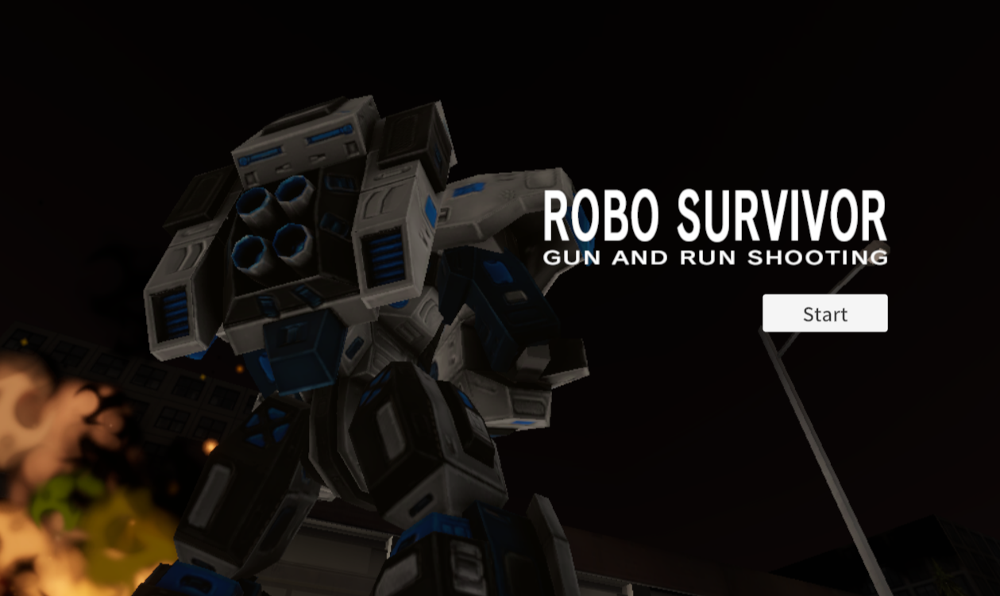
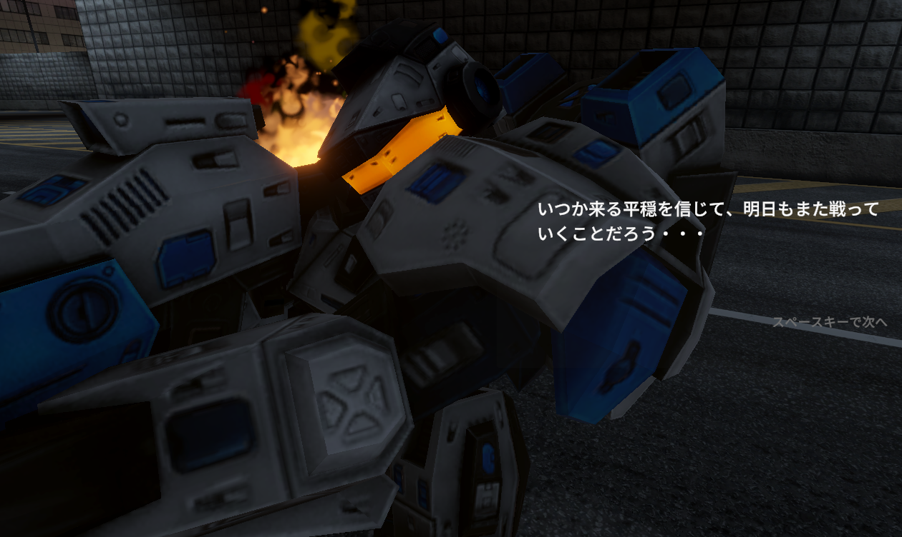
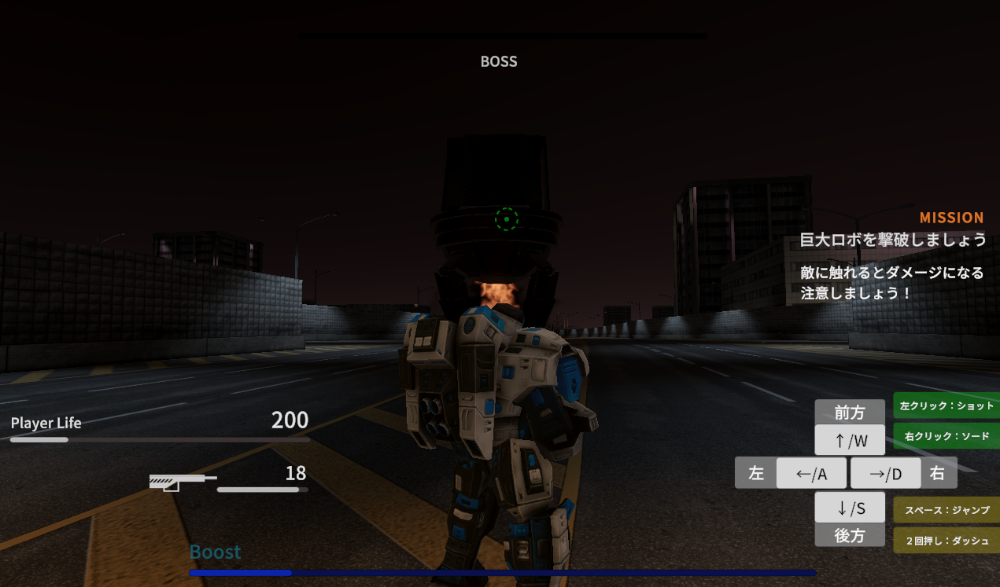
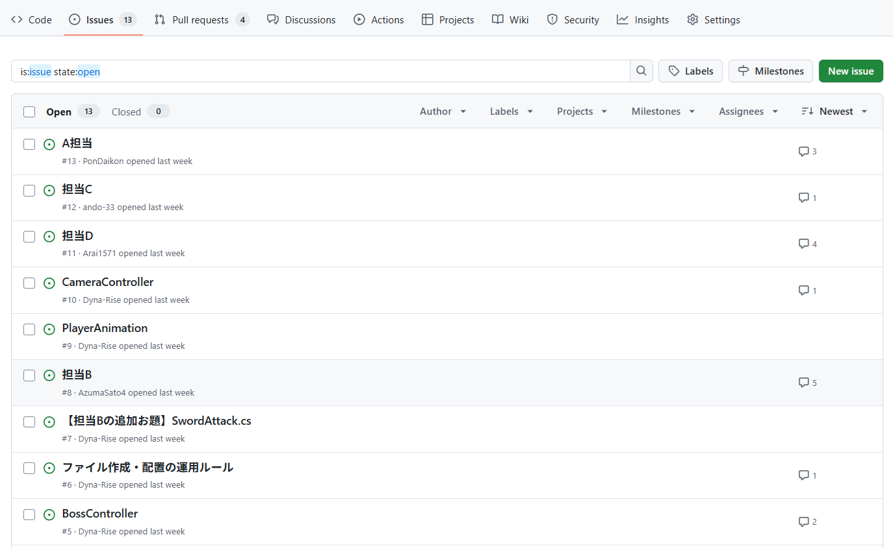

# RovoSurvivor（共同製作ゲーム）
## プロジェクト概要
RovoSurvivorは職業訓練にて、4名チームで共同製作した3Dアクションゲームです。  
ロボットを動かし、エネミーを無限生成するゲートを潰しながら街を探索します。最後にボスを撃破することを目的とした爽快なゲームです。  
  
  
  

* 制作人数：4名  
* 制作期間：4日間  
* 使用エンジン：Unity Editorバージョン 6000.0.54f1 
* シーンレンダー：Universal 3D 
* 使用言語：C#  
* 使用アセット：（いずれもUnityアセットストアから）  
 Demo City By Versatile Studio (Mobile Friendly) →　バトルフィールド  
 Robot Hero : PBR HP Polyart　→　プレイヤーとエネミーのモデル  
 Delivery Robot　→　ボスモデル  
 Slash Effects FREE　→　エフェクト：接近攻撃のブレード  
 Free Quick Effects Vol. 1 →　エネミーを生産するゲートモデルや爆発・炎のエフェクト
* Fontデータ： Noto Sans JP-Medium SDF (TMP_Font Asset)  
* そのほかの使用ツール：GitHub、SorceTree、VisualStudio、Googleドライブ(スプレッドシート)で情報共有

## サンプルゲーム
ぜひゲームを体験してみてください！  
[RoboSurvivorサンプル]([http://](https://dynarise2001.xyz/kunren/sample/robosurvivor_alpha/))

## ゲームフロー
* タイトル  
  
  
* オープニングシーン  
ストーリーの説明をしながらこれからバトルが始まるという緊張感を高めます  
  

* ゲームステージ（操作パート）  
街中のエネミーを殲滅します！  
画面右の指示にしたがって行動をすることになります。  
まずはエネミーを無限に生成するゲートを叩き、生き残ったエネミーを殲滅するといよいよボスステージです！  
  
  
* ボスステージ（操作パート）  
ボスステージに移行すると巨大なボスロボとのバトルになります。  
ボスは距離に応じた複数のアクションをとるので、行動を見極めながら攻撃を叩きこみます。  
BOSSのライフを0にすることができたらボス撃破！エンディングシーンへと続きます。  
  

* エンディングシーン  
エンディングでは悲しげなBGMにあわせて、ひとときの休息を得たことを告げるテキストを読み上げます。  
カメラワークが最後に天を見上げたところでタイトルに戻ります。  
  
  
## 操作方法
前後・左右　移動：WASDキー、または矢印キー  
ジャンプ：スペースキー  
プレイヤーの視点：マウス  
ショット攻撃：マウス左クリック　※弾数制限あるので打ちすぎ注意  
接近攻撃（ブレード）：マウス右  
  
プレイヤーにもライフがあり、ライフ0でゲームオーバーとなるので注意！  
  
  
## 共同製作における主な担当パート
共同製作では主にボスの制御を担当しました。  
ボスオブジェクトに対してBossController.csスクリプトを構築、臨場感のあるバトルを目指しました。  
  
### 3つのアクション  
ボスには距離に応じた3つのアクションを持たせ、遠距離ではランダムに2種、近距離では1種の行動をつくりました。
* タックル（遠距離）  
* ショット（遠距離）  
* バリア展開（近距離）  
それぞれアクションにあわせたコルーチンを構築し、繰り返し（UpDate）の中でプレイヤーの距離に応じたコルーチンを選択してきます。  
  
```C#
void Update()
    {
        //ゲーム状態がプレイ中でなければ何もしない
        if (GameManager.gameState != GameState.playing) return;
        if (bossHP <= 0) return;
        if (player == null) return;

        // ダメージ中の点滅処理
        if (isDamage)
        {
            Blinking();
        }

        if (isAttacking) return; // 攻撃中は処理をスキップ


        timer += Time.deltaTime; //ゲームの経過時間

        //プレイヤーとの距離を測る
        float distanceToPlayer = Vector3.Distance(transform.position, player.transform.position);

        // 攻撃のクールダウン
        if (timer >= attackInterval)
        {
            isAttacking = true; //攻撃中フラグをON
            if (distanceToPlayer <= closeRange)　// Playerが近い時
            {
                // バリアを展開
                StartCoroutine(ActivateBarrier());
            }
            else　// Playerが遠い時 (detectionRange内)
            {
                // タックルか球を飛ばすかをランダムで決定
                int randomAction = Random.Range(0, 2); // 0: タックル, 1: 球を飛ばす

                if (randomAction == 0)
                {
                    StartCoroutine(Tackle());　//タックル
                }
                else
                {
                    StartCoroutine(ShootProjectile()); //シュート
                }
            }
            timer = 0; //リセット
        }
    }
```
  
### 倒したときの爽快感
アクションゲームとして緊張感のあるバトルの末に撃破した爽快感、達成感が大切だと思います。  
担当したボスは撃破時に爆発エフェクトがおきるので、倒したという実感をしっかりを感じることができます。  
また、倒してからエンディングまでにプレイヤーに達成感と余韻を残すことで、もう一度プレイしてみたくなるような手応えを目指しました。  
  
  

```C#
 //HPがなくなったら削除
if (bossHP <= 0)
{
    //爆発音を鳴らす
    audioSource.PlayOneShot(se_Explosion);

    //爆発エフェクトの生成
    GameObject obj = Instantiate(
        explosionPrefab,
        transform.position,
        Quaternion.identity
        );

    obj.transform.SetParent(transform); //爆発がボスについていくように
    Destroy(gameObject, 1.0f); //エフェクト分1秒まってからボスの消失

    //消滅からゲームステータスが変わるまでの時間差コルーチン
    StartCoroutine(BossDestroy());
}

//撃破からエンディングにいくまでの時間差（余韻）
IEnumerator BossDestroy()
{
    yield return new WaitForSeconds(5.0f); //5秒待つ
    GameManager.gameState = GameState.gameclear; //ゲームステータスを変更してエンディングへ
}
```
## 共同開発におけるレビューを行いブラッシュアップ
まずは最初の2日間でプロトタイプを完成させるために担当箇所を構築しました。  
それぞれの担当箇所をGitHubを活用してマージし、当日デバッグに回れるメンバーでデバッグプレイしてプロトタイプへの評価を行いました。  
この評価に関してチームミーティングを行い、改善点と改善方法を定め残りの2日間で調整を行うことでブラッシュアップしました。自身の追加の担当作業として、「Enemyを生成するGate」の改善を行いました。当初、Gateから敵が生成された際、決まった座標から生成されるため、敵から距離を取り、エイムを生成座標に合わせ、連射をすることで簡単に敵を倒すことができるプログラミングでt￥あった。そこで、Gateの子オブジェクトに「GateSpot」を複数配置し、そのうちの一つからランダムに敵が生成されるプログラミングへと改善を図り、難易度をちょうど良い塩梅へと調節ができました。
  
  
  
## GitHub上でのマージ作業を意識して担当範囲に最新の注意
スピードが要求される制作期間において、マージ作業で大きなトラブルを生まないようチームの取り決めを忠実に順守しました。  
GitHubのIssuesを通じて進捗や問題点については随時チームへの報告や問題提起を行っています。
  
  
SourceTreeでブランチを分けてコンクリフト衝突がおこらないよう細心の注意を払いました。  
また定期的なコミットを通してバックアップも万全にしました。  
  
  
## 共同開発に関する工夫
### 仕様から反れていないかの確認作業
チームの打ち合わせで大体の方向性・仕様はあったものの、細かい部分は自身の考えに委ねられる環境でした。  
私の場合はとにかくユーザーが爽快に何回でもバトルしてみたくなる手応えを大事にしましたので、SEによる臨場感やシーン切り替えのタイミングなどを気にしました。  
一方でこだわった結果、チームとして想定された仕様や方向性から逸脱していないかも心配な部分でしたので、疑問に思った部分はチームリーダーにマメに確認をとり、マージする際の影響なども考えながら慎重に改良を重ねることができました。  
  
例えば、当時の心配ごととして、気軽に斬撃で勝てないよう近づきすぎるとボス本体からダメージ判定をもらうのを是としていたのですが、これが仕様上問題ないかはきちんと確認をいれました。  
  
### 細かいコミット作業
とにかく自分のデータにトラブルがあると、全体に影響が出てしまうので何か大きな変更を行う際にはコミットによるバージョン管理によって、いつでももとに戻れるように気を使いました。  
またコミットだけではなくプッシュを意識してクラウドにバックアップが常にある状態の維持に努めました。  
  
特にボスがタックルしてくるコルーチン制作には調整に大変苦労しましたので、コードにコメントを多く残すと同時に確実にコミットとプッシュしていくよう意識しました。
  
### 納期の意識
チーム開発ということで自分のせいで周りに影響がでないよう良い意味でプレッシャーを感じていたのですが、それ以上にこれをプレイするユーザーを意識して時間内に必ず間に合わせるという意識を大切にしました。そのために何日に何ができていないといけないという逆算に加え、さらに半日～1日余裕をもたせるようにスケジューリングしました。  
詰まってしまったところは、自分でこだわる部分とそうでない部分を「納期に間に合うか」で天秤にかけることで、リーダーに助力を乞うタイミングは基準を決めやすかったです。  
  
具体的にはボスのバリア展開について細部がどうしても腑に落ちず、自分でも追及したい気持ちが高かったのですが中間のプロトタイプまで時間が迫っていたので、逆に早めにリーダーに確認をすることとし、その代わり解説してもらった原理は徹底的に理解するように努めました。  
  
### AIの活用
自分で考えれる部分は多かったのですが、一部時短もかねてAIを大いに活用しました。  
しかし、AIが出したコードだけでは不十分なものも多かったので、大枠はAIの案を採用しつつも細部は自分で修正するという作業をしたことで出だしが早く無事納期に間に合わすことができたと思います。  
* 仕様ツール：Google AI Studio　「Gemini 2.5 Pro」

## 今後の課題
他の担当者のパートも含めゲーム全体の内容を理解はしていますが、上空を飛び交うヘリのようなNavMeshAgentコンポーネントを活用しづらいコードについては未挑戦なので、ぜひ次回以降に作ってみようと思います。  
調べたところ、いくつかの方法のうちエネミーのルーティングを行うのが一番自然だと感じましたので挑戦してみます。  
[参考サイト：Unity入門の森/移動経路の構築とOnDrawGizmosによる移動経路の可視化](https://feynman.co.jp/unityforest/game-create-lesson/tower-defense-game/enemy-route/)
  

  


